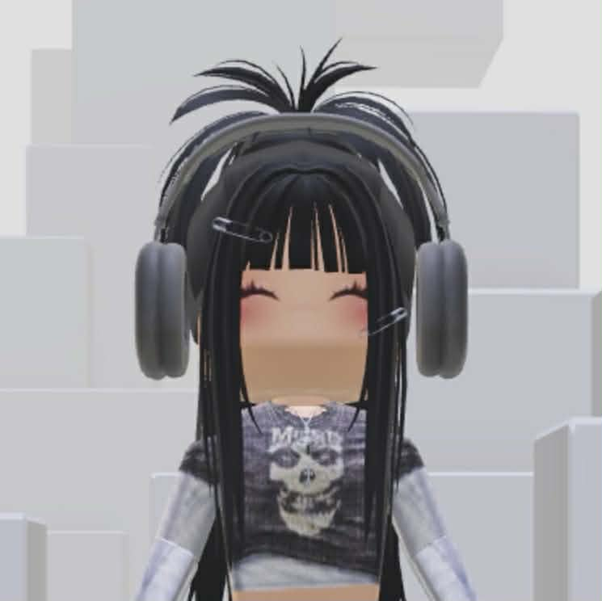

# 
👗 POWER POP 🧣

<small><b>Your console based dress up & color analysis system</b></small>

<small><b>IT 2111</b></small>

<small>Dimaculangan, Annika M.</small>

<small>Maralit, Alyka Denise A.</small>

<small>Mendoza, Allana Maryse R.</small>

# **Overview** ‧₊˚✩彡

This console-based program assists users in discovering the seasonal color that best suits them based on their inputs, as well as identifying their body type from the measurements they provide. Additionally, the system includes a dress-up feature that offers feedback on the user’s outfit, taking into account body type, color choices, and providing a brief comment on the overall compatibility and style of the selected clothing. 

Overall, it aims to make color analysis fun, practical, and easy to understand for everyday styling.

# ᛝ‧₊˚┆ Project structure 〢

     📂 src/  
       └── ☕ Project.java

# ༄.° How to Run the Program 𖦹˙—
1. Open your terminal.  
2. Navigate to the folder where **Project.java** is located:  
3. Compile the program:
   
          javac Project.java
5. Run the program:
   
          java Project

# 𐔌՞. .՞𐦯 OOP - Principles

# ⤷ ゛ Features ˎˊ˗
1. **Enter Personal Information.** Input name and age to create a user profile.  
2. **Determine Undertone.** Identify skin undertone (Warm, Cool, Neutral) by answering questions about vein color, jewelry preference, and paper reflection.  
3. **Discover Seasonal Color Type.** Find seasonal color category (Winter, Summer, Spring, Autumn, Soft Summer, Soft Autumn) based on undertone, hair color, eye color, and skin depth.  
4. **Identify Body Type.** Calculate body type (Inverted Triangle, Pear, Hourglass, Rectangle) using bust, waist, and hip measurements.  
5. **Browse Catalog.** View a complete list of tops, bottoms, and accessories in a neatly organized table.  
6. **Select Outfit.** Choose tops, bottoms, and up to two accessories to create an outfit.  
7. **Input Outfit Color.** Enter the planned outfit color to check if it matches your undertone.  
8. **Receive outfit Feedback.** Get a final evaluation of your outfit’s compatibility with your body type and undertone, including a score-based recommendation.  

# 𐔌 ⋮ Contributors ₊ ꒱

| Photo | Name | Role |
|-------|------|------|
|  | Annika M. Dimaculangan | Role |
|  | Alyka Denise A. Maralit | Role |
|  | Allana Maryse R. Mendoza | Role |

# ᯓ 𑣲 : Acknowledgement ꩜⋆˚

We would like to express our heartfelt gratitude to everyone who supported us throughout the completion of our OOP project, Power POP! Our sincerest thanks go to our instructor, **Ma'am Grace Alib**, for her invaluable guidance, encouragement, and support. We are also deeply grateful to our friends for their unwavering support from start to finish. ✧₊⁺

# ◟♯  Disclaimer

This project and its contents are intended solely for demonstration and learning purposes. While the program aims to provide helpful results, we cannot guarantee 100% accuracy at all times. Users are advised to treat this as a temporary tool and not a fully reliable final solution.

